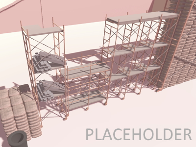

# Columbia College Chicago Alumni Jammers
We are a group of alumni, current students, and hobbyists that work together on game development projects.
Our mission is to provide a space for game developers, designers, artists, and audio engineers to
continue learning and improving on their skills in game development.

## Organizers
|     | Name | Role | Contact |
|-----|------|------|---------|
| </img> | Andrew Forster | Founder, Organizer | |
| </img> | Dirk Matthews | Alumni Relations | |
| </img> | Jethro Schoppenhorst | Maintenance, DevOps | jethro.schoppenhorst@gmail.com |

## Projects
---

</img>

  </img>
  </img>
  </img>
  </img>

- [Project Repository](https://github.com/JSchoppe/CindyBrock-LegendOfTheKeytar) 
- [Play __*Cindy Brock and the Legend of the Keytar*__](https://ianjeannin.itch.io/battle-royal-rhythm) 
- [Listen to the __*Cindy Brock and the Legend of the Keytar*__ soundtrack](https://ianjeannin.itch.io/battle-royal-rhythm)

<table align="center">
  <tr>
    <th>Platforms</th>
    <th>Workflow</th>
    <th>Contributors</th>
  </tr>
  <tr>
    <td>
      
    </td>
    <td>
      
    </td>
    <td>
      
      
    </td>
  </tr>
</table>

---
